#Atoms
## 8 - Atoms.IDE

Al finalizar el capítulo anterior hablamos de [Atoms.App](https://github.com/tapquo/atoms-app) una extensión del *core* de Atoms que nos ofrece todo una lista de elementos: *Atom*, *Molecule* y *Organism* específicos para la creación de Web Applications. Ahora vas a conocer otra extensión del *core*, Atoms.Ide, la cual se encarga de gestionar Atoms.App para poder diseñar Web Applications por medio de un IDE:

Como puedes ver se trata de un completo IDE el cual te permitirá generar toda la estructura de tu aplicación y como aprendiste en anteriores capítulos generará toda la fusión entre *Atom*, *Molecule* y *Organism*:

  - Pudiendo definir los atributos especiales de cada elemento
  - Gestionando los atributos especiales `events`, `callbacks`, `bind`... 
  - Previsualizando la jerarquia de elementos
  - Exportando un proyecto
  
Atoms.Ide y [Atoms.App](https://github.com/tapquo/atoms-app) son 2 extensiones que demuestran la enorme capacidad que tiene Atoms, por ejemplo Atoms.App es utilizado por Atoms.Ide para poder crear otras instancias de Atoms.App. Parece un travalenguas pero lo podemos llamar modo *Inception*.

### 8.1 - Comenzando un nuevo proyecto
Para comenzar un nuevo proyecto con Atoms.Ide debes estar [registrados](http://atoms.tapquo.com/session) en la plataforma como un *Atoms Developer*. Una vez esto 

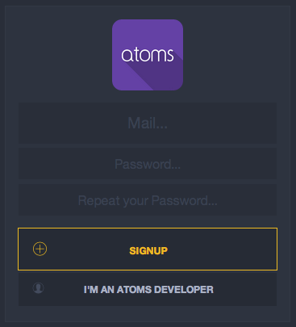

Una vez esto entraras en la vista de proyectos donde tendrás una lista con todas tus instancias de Atoms.App asi como 

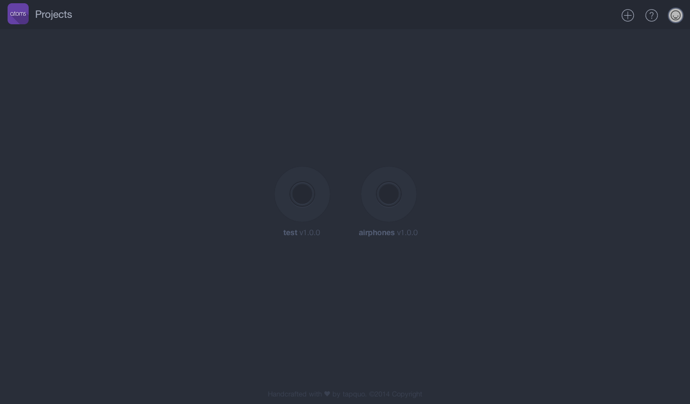

En el caso de que queramos crear una nueva, unicamente tendrémos que pulsar sobre el icono (+) situado en la parte superior derecha donde nos aparecerá la siguiente ventana:

En esta ventana unicamente tenemos que elegir el nombre de nuestra instancia de Atoms.App asi como una breve descripción de la misma. Tras ello comenzaremos con lo que consideramos una verdadera revolución a la hora de crear *Web Applications*, ya de por si Atoms es un paradigma del desarrollo de muy alto nivel pero con la extensión Atoms.Ide la experiencia se convierte en una experiencia inigualable. Vamos a familiarizarnos con el IDE:

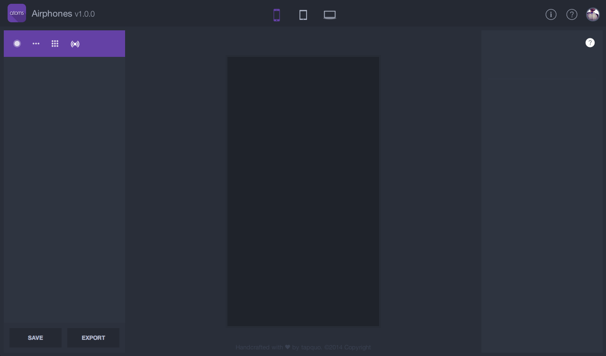

Si pulsamos sobre el icono `(?)` situado en la parte superior derecha entraremos en el modo ayuda, el cual nos describirá como funciona toda la interfaz propuesta. 

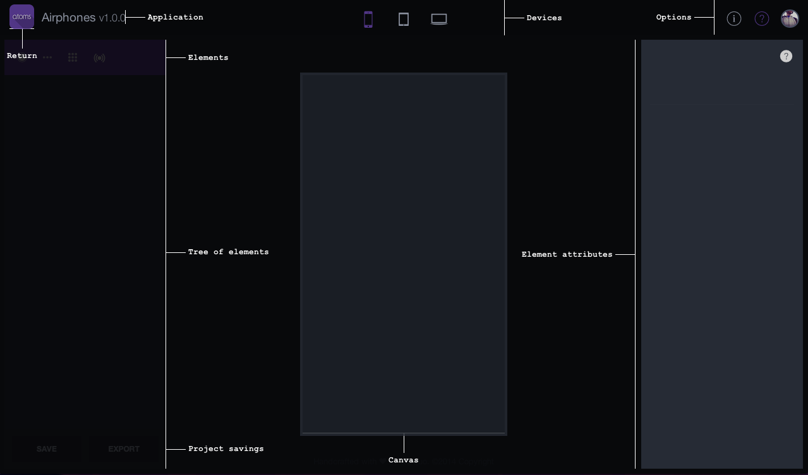

Tenemos 4 areas bien diferenciadas:

  - SUPERIOR: Información del proyecto y usuario.
  - IZQUIERDA: Elementos *Atom*, *Molecule*, *Organism* y *Extension* utilizados en el proyecto.
  - CENTRAL: Lienzo donde podemos ver el comportamiento de estos elementos.
  - DERECHA: Atributos del elemento seleccionado.
  
Si quisieramos modificar algún dato de tu proyecto o crear una nueva versión del mismo debes pulsar en el icono (i) situado en la parte superior derecha:

Desde ese mismo area si pulsamos sobre el *avatar* podrás modificar tus datos personales como Atoms Developer:

En el caso de que quieras regresar a la vista de proyectos disponibles unicamente tienes que pulsar sobre el icono de Atoms, en la parte superior izquierda. 

### 8.2 Elementos
Como estudiaste en los capítulos anteriores Atoms te provee de un sistema de elementos los cuales estan agrupados por niveles de complejidad y responsabilidad. Para conocer los elementos actuales se encuentran agrupados en la siguiente barra de navegación:

Poniendonos encima de cada icono descubrirémos el listamo de elementos: *Atom*, *Molecule* y *Organism*:

En este mismo capítulo descubrirás las extensiones de Atoms.App, recordando que Atoms es un sistema Atómico e infinito en la creación de nuevos elementos.

### 8.3 Drag & Drop
Como ya sabes Atoms se basa en la creación de un sistema complejo a partir de elementos más sencillos, y en nuestro IDE se traduce de igual manera por lo que comenzaremos arrastrando un elemento Organism e iremos creando su composición interna a base de otros elementos: *Atom*, *Molecule* e incluso *Organism*. Si nos ponemos sobre el icono de Organisms verémos que existen 2 areas:

  - Bases: Contenedores maestros
  - Areas: Subcontenedores que pueden añadirse a los contenedores maestros
  
Ambas son *Organisms* no difieren en absolutamente nada, pero Atoms.App ha creado diferentes comportamientos y responsabilidad para estos elementos para que sea mas sencilla la composición de las vistas de nuestra Web Application. Por lo que comenzarémos arrastrando el `Organism.Article` sobre nuestro lienzo quedando la vista de la siguiente manera:

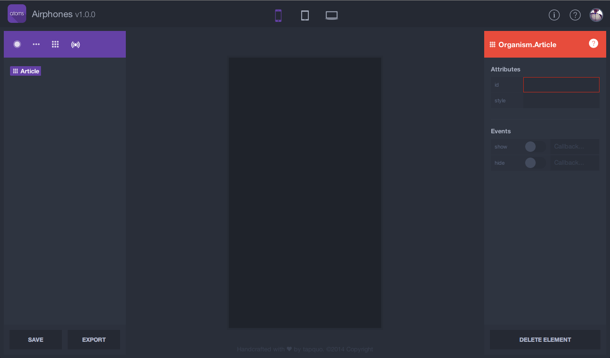

Como has podido comprobar al arrastrar el elemento sobre el canvas (lienzo) este se ha marcado con un color rojo (Organism) indicando que es aceptado. A su vez puedes comprobar como la parte de atributos de elemento ha detectado que has seleccionado un `Organism.Article` y nos da la posibilidad de cambiar los atributos del mismo. Vemos que el atributo *id* es obligatorio al ser marcado de color rojo y que podemos tambien activar los `events` disponibles e incluso definir los `callbacks`; algo que como viste teníamos que hacerlo por medio del constructor de una determinada clase y en el caso de los *Organism* tambien podiamos hacerlo por medio de un fichero scaffold (json o yaml); con Atoms.Ide es mucho más sencillo mantener los atributos. 

En el caso de que tengas algún tipo de consulta de un determinado elemento puedes pulsar sobre el icono `(?)` que se encuentra en la sección de atributos y aparecerá toda la documentación disponible para ese elemento. 

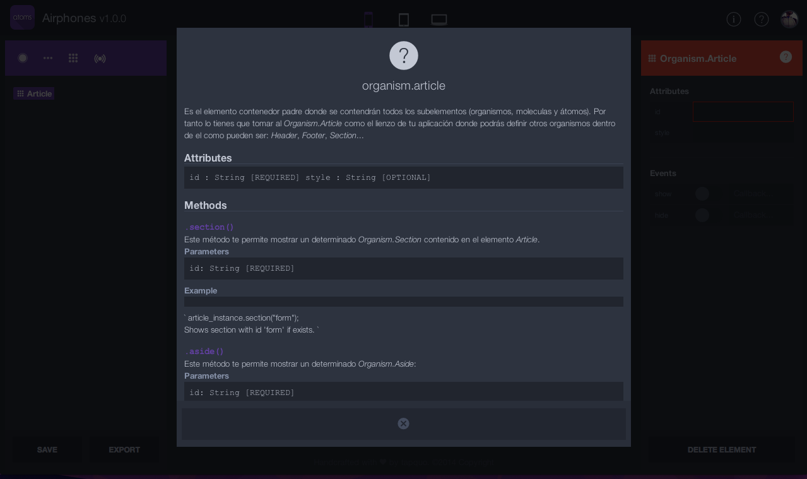

Ahora vamos a seguir diseñando la estructura de nuestra WebApplication arrastrando al canvas los Organism: *Header*, *Footer* y *Section* sobre `Organism.Article`. Como resultado obtendrémos:

Como vemos el area de elementos va creando la jerarquia y `Organism.Article` se convierte en un contenedor de `Organism.Header`, `Organism.Footer` y `Organism.Section` que como podemos comprobar aunque el orden ha sido *Header*, *Footer* y *Section* son representados de la siguiente manera *Header*, *Section* y *Footer*, esto es así porque Atoms.App tiene un sistema implicito de *weights* para todos sus elementos dandonos la posibilidad de no poder equivocarnos en el diseño visual de nuestras Web Applications. Como has podido comprobar ahora podemos seleccionar cualquier elemento y el area de atributos cambia con sus propiedades en (el caso de Atoms.Header vemos que no dispone de `events`). 

Antes de pasar a la modificación de atributos vamos a arrastrar un `Atom.Heading` dentro de nuestro `Organism.Footer` comprobando que esa acción es imposible puesto que este no tiene como `@available` ese *Atom*. En cambio si lo intentamos arrastrar al resto de *Organism* vemos que estos se activan con el característico color rojo indicando que si es aceptado en su jerarquia:

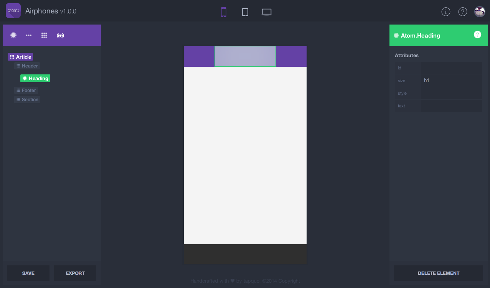

En nuestro caso vemos que al ser arrastrado el `Atom.Heading` sobre `Organism.Header` se marca de color verde (Atom) tanto el elemento en el canvas como el area de atributos. Por último pulsa el boton "Save", situado en la parte inferior izquierda, para guardar el estado actual de tu proyecto o bien pulsa la combinación de teclas CTRL+SAVE.

### 8.4 Atributos
Ahora vas a comprobar como el *Core* de Atoms hace acto de presencia ya que como aprendiste en el capítulo destinado a [Eventos](https://github.com/soyjavi/atoms-documentation/blob/master/ES/06.md) existe un sistema de comunicación *Bubbling*/*Tunneling*. En nuestro proyecto vamos a comenzar a modificar los atributos del elemento `Atom.Heading` desde el area de atributos:

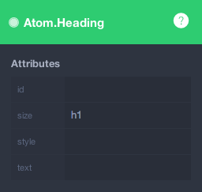

Al cambiar cualquier atributo veremos como tanto el area de elementos como el canvas reaccionan en tiempo real a esos cambios, esto es así porque el area de atributos lanza eventos *Bubble* con la información de los nuevos atributos y el resto de elementos, en el caso de que tenga handler, reaccionan a esa información. Ahora vamos a establecer el atributo `text` con el valor `"My First App"` y verémos como reacciona Atoms.Ide:

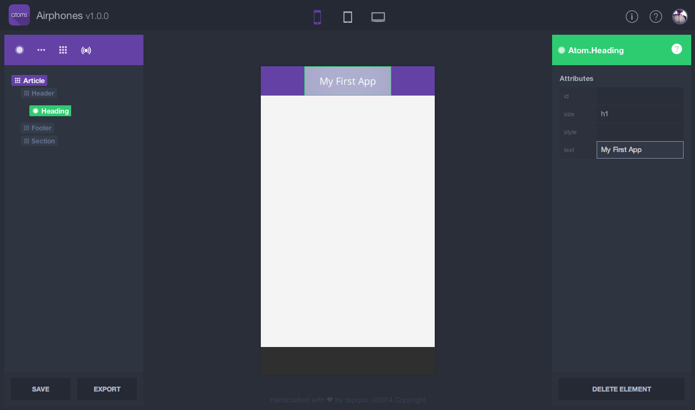

Ahora vamos a arrastrar un elemento `Molecule.Navigation` en el `Organism.Header` y vamos a establecer los siguientes attributos:

 - `style` a `"right"`: indicando a Atoms.App que lo situe en la parte derecha de su contenedor  
 - `id` a `"menu"`: para crear un simbolo `@menu`
 - `events` activaremos el único evento que existe `select`
 
Con todas estas modificaciones podemos ver el area de elementos crea unos *helpers* para indicarte que has establecido un `id`, has modificado el `style` por defecto y que el elemento publicará `events`.

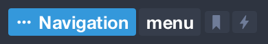

Ahora vamos a establecer un par de elementos `Atom.Button` dentro de nuestra `Molecule.Navigation`, podemos intentar arrastrarlo sobre el `Organism.Header` y verémos que no los acepta. Estos elementos, dentro de la extensión Atom.App, tienen como proposito realizar algún tipo de acción con `@events` o bien utilizarse como enrutador con el atributo `path`. Como podemos comprobar el evento `touch` esta activado por defecto, y vamos a establecer un `icon` para ello haremos click sobre su input y apareciendo la siguiente ventana:

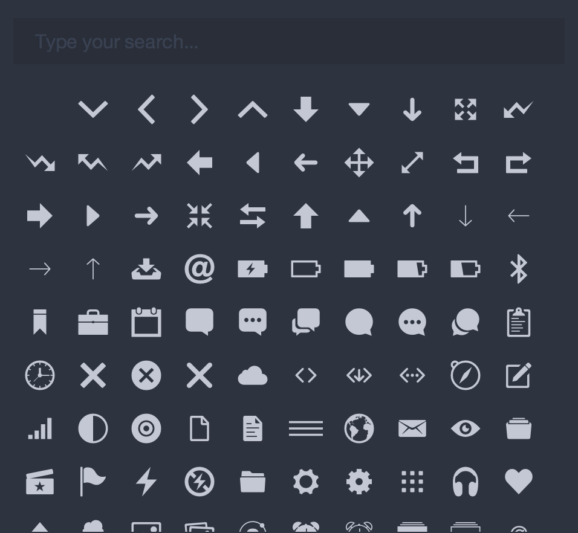

Buscamos un icono con el texto `"plus"` lo seleccionaremos y vemos como el canvas lo representa automáticamente, para el otro `Atom.Button` realizaremos el mismo proceso seleccionando el icono `"search"` quedando nuestra Molecule.Navigation de la siguiente manera:

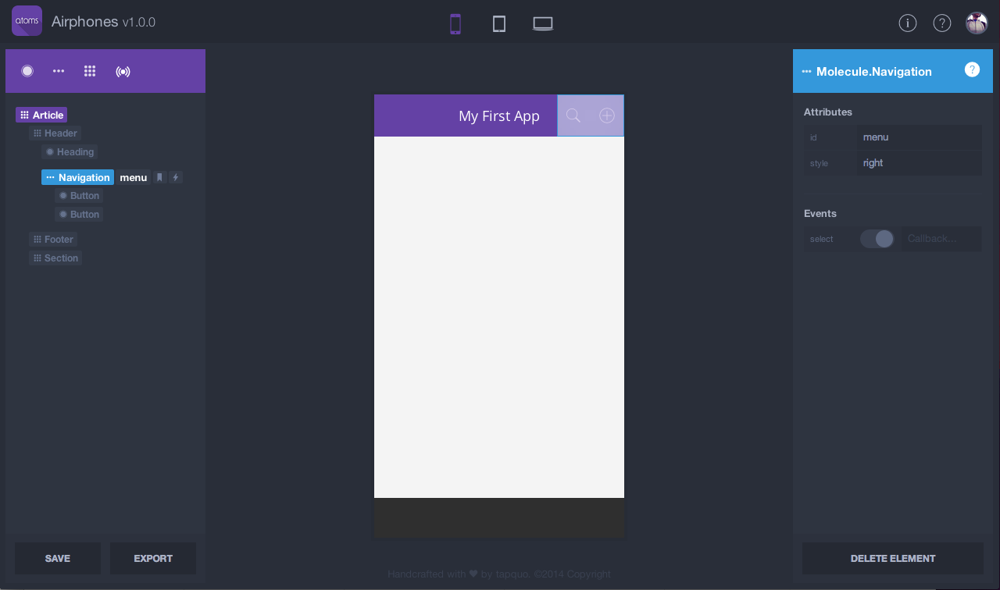

Ahora en nuestro `Organism.Footer` vamos a crear otra `Molecule.Navigation` y la vamos a utilizar para navegar entre diferentes `Organism.Section` dentro de nuestro `Organism.Article`. Para ello, antes de comenzar con la enrutación, vamos a establecer el atributo `id` a todos los `Organism.Article`/`Section` que tengamos ya que es necesario para poder utilizar el atributo `path` de los `Atom.Button`. Vamos a dejar una estructura con los siguientes atributos `id`:
 
  - Organism.Article: `main` 
  - Organism.Section: `first` 
  - Organism.Section: `second` 
  - Organism.Section: `third`
  
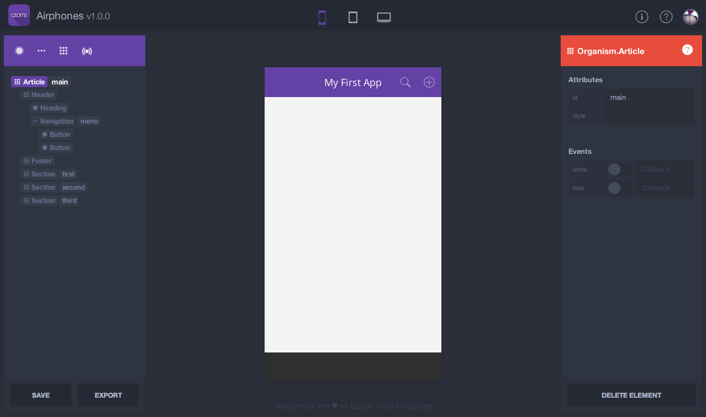

Ahora ya podemos crear nuestra `Molecule.Navigation`, que contendrá tres botones con el atributo path, para ello tienes que dejar una estructura en tu lista de elementos de la siguiente manera:

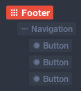
  
Como has podido comprobar con cada nuevo `Atom.Button` dentro de un `Molecule.Navigation` se redimensionan los elementos para que todos sean proporcionados. Ahora vamos a comenzar a establecer un `path` a nuestro primer botón y mágicamente al seleccionar una ruta nos aparece un selector con todas las rutas disponibles:

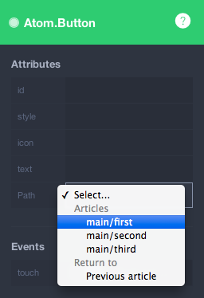

El patrón que utiliza Atoms.App se basa en tomar como vista principal el `Organism.Article` y como subvista cualquiera de los `Organism.Section` que este contenga. En capítulos posteriores verémos como establecer rutas dinámicas con el modulo `Atoms.App.Url`, ahora nos toca establecer a nuestros Atom.Button los atributos `path` e `icon`:
  
  - 1) `main/first` y `person-b`
  - 2) `main/second` y `people`
  - 3) `main/third` y `ios7-cog`
  
Obteniendo como resultado en nuestro *Canvas*:

Viendo como aparece un nuevo helper en el area de elementos indicando que ese botón tiene un comportamiento de enrutador:

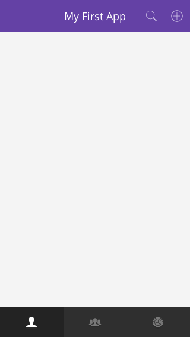 

Ahora vamos a ver como `Atoms.Ide` es capaz de comunicar al enrutador de `Atoms.App` que visualice el `Organism.Section` con el que necesitamos trabajar, tan sencillo como en el area de elementos seleccionar `Section/First`. Ahora que estamos trabajando con nuestro primer `Organism.Section` vamos a establecer el `style` a `"padding"` y crear la siguiente estructura:

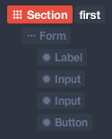 

Ahora vamos a establecer los atributos a cada uno de los elementos *Atom* de `Molecule.Form`:
  
  - `Atom.Label`:
    - icon: person-b
    - text: Session
  - `Atom.Input`:
    - type: text
    - name: username
    - placeholder: Your username...
    - style: big
    - maxlength: 8
  - `Atom.Input`:
    - type: password
    - name: password
    - placeholder: Your password...
  - `Atom.Button`:
    - style: fluid accept
    - text: Sign In
    
Comprobando que la representación de nuestro formulario en el *Canvas* comienza a tener sentido:

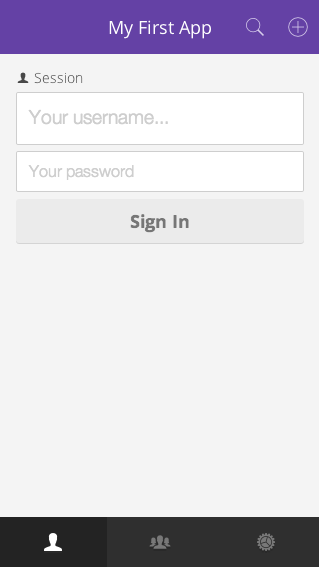 
    
Ahora vamos a trabajar con el `Organism.Section` que tiene como `id` a `"Second"`, viendo que Atoms.Ide nos lo muestra ocultando automáticamente `"First"`:

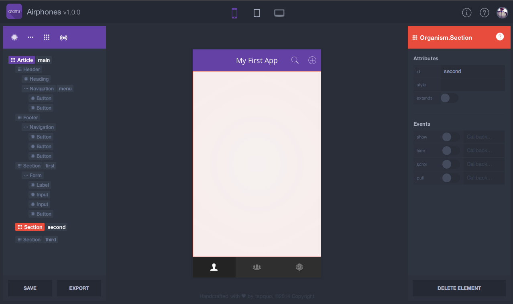 

Con esto finalizamos este capítulo, poco a poco nuestro primer proyecto va cogiendo forma y como estas comprobando todo se basa en *Drag&Drop* (Arrastrar y Soltar) elementos dentro de una jerarquia y estableciendo sus `attributes`.

### 8.5 Extensiones

### 8.6 Exportar

### 8.7 Comenzando a desarrollar

